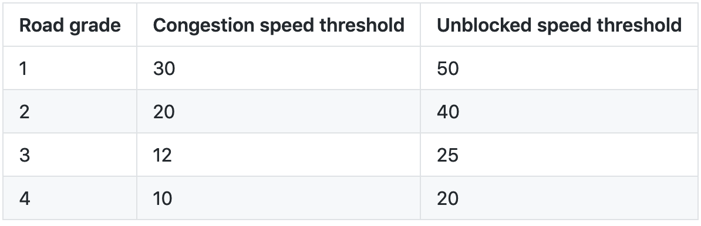

# ladcn.github.io

## Road Status Definition

###### Table 1 Road speed threshold table

Road status categories are based on road grades and road speeds. We classify roads into different grades according to road width, speed limit level, etc. The higher the road grade, the worse the road facility. As shown in Table 1, we use different road speed thresholds to classify road status for different road grades. If the road speed is below congestion speed threshold, the road status is congestion. If the road speed is above unblocked speed threshold, the road status is unblocked. If the road speed is between two threshold, the road status is slow.  
